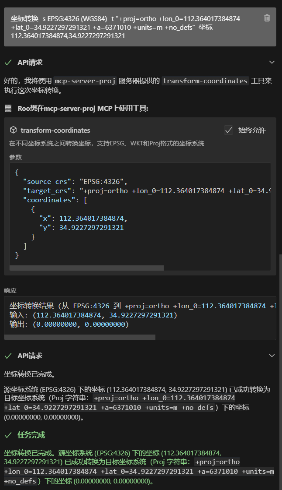

# mcp-server-proj MCP server

MCP Server PROJ (cartographic projections and coordinate transformations)



### Tools

The server implements two coordinate transformation tools:

1. transform-coordinates
   - Transforms coordinates between different coordinate systems
   - Supports the following coordinate system formats:
     - EPSG codes (e.g., EPSG:4326 for WGS84)
     - WKT format
     - Proj format
   - Required input parameters:
     - source_crs: Source coordinate system
     - target_crs: Target coordinate system
     - coordinates: Array of points with x, y values
   
   Example: Transform from WGS84 (EPSG:4326) to Orthographic projection
   ```
   Input:
   - source_crs: EPSG:4326
   - target_crs: +proj=ortho +lon_0=112.364017384874 +lat_0=34.9227297291321 +a=6371010 +units=m +no_defs
   - coordinates: [112.364017384874, 34.9227297291321]
   
   Output:
   - transformed coordinates: [0.00000000, 0.00000000]
   ```

2. list-supported-crs
   - Lists all supported coordinate system formats with examples
   - Provides detailed examples for:
     - EPSG code format
     - WKT format for geographic and projected coordinate systems
     - Proj format

## Configuration

### Claude Desktop

On MacOS: `~/Library/Application\ Support/Claude/claude_desktop_config.json`
On Windows: `%APPDATA%/Claude/claude_desktop_config.json`

<details>
  <summary>Development/Unpublished Servers Configuration</summary>

```json
{
  "mcpServers": {
    "mcp-server-proj": {
      "command": "uv",
      "args": [
        "--directory",
        "E:\Code\PythonDir\MCP\mcp-server-proj",
        "run",
        "mcp-server-proj"
      ]
    }
  }
}
```
</details>

<details>
  <summary>Published Servers Configuration</summary>

```json
{
  "mcpServers": {
    "mcp-server-proj": {
      "command": "uvx",
      "args": [
        "mcp-server-proj"
      ]
    }
  }
}
```
</details>

### Debugging

Since MCP servers run over stdio, debugging can be challenging. For the best debugging
experience, we strongly recommend using the [MCP Inspector](https://github.com/modelcontextprotocol/inspector).

You can launch the MCP Inspector via [`npm`](https://docs.npmjs.com/downloading-and-installing-node-js-and-npm) with this command:

```bash
npx @modelcontextprotocol/inspector uv --directory E:\Code\PythonDir\MCP\mcp-server-proj run mcp-server-proj
```

Upon launching, the Inspector will display a URL that you can access in your browser to begin debugging.